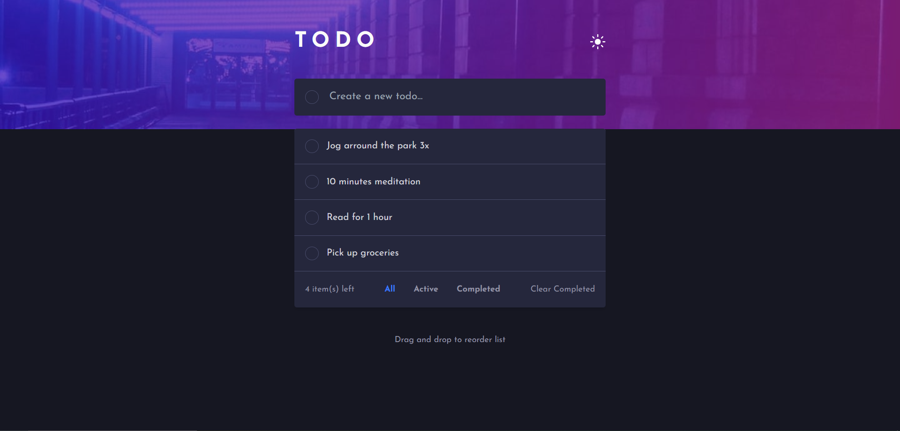

# Frontend Mentor - Todo app solution

This is a solution to the [Todo app challenge on Frontend Mentor](https://www.frontendmentor.io/challenges/todo-app-Su1_KokOW). Frontend Mentor challenges help you improve your coding skills by building realistic projects.

## Table of contents

- [Overview](#overview)
  - [The challenge](#the-challenge)
  - [Screenshot](#screenshot)
  - [Links](#links)
- [My process](#my-process)
  - [Built with](#built-with)
- [Author](#author)

## Overview

### The challenge

Users should be able to:

- View the optimal layout for the app depending on their device's screen size
- See hover states for all interactive elements on the page
- Add new todos to the list
- Mark todos as complete
- Delete todos from the list
- Filter by all/active/complete todos
- Clear all completed todos
- Toggle light and dark mode
- **Drag and drop to reorder items on the list**

### Screenshot
- Desktop view [ Dark Theme ]
  

- Desktop view [ Light Theme ]
  
---

- Mobile view [ Dark Theme ]
- 
- Mobile view [ Light Theme ]
- 

### Links

- Solution URL: [Solution URL](https://www.frontendmentor.io/solutions/todo-app-solution-using-angular-17-and-tailwind-css-izG1pNv8UE)
- Live Site URL: [Live Site URL](https://todo-app-taupe-eta.vercel.app/)

### Built with

- Semantic HTML5 markup
- Tailwind CSS
- [Angular](https://angular.dev/) - JS Framework
- Angular **Signals** to manage application state
- Angular Material ***CDK*** to set up the drag and drop features

## Author

- Frontend Mentor - [@Da-achraf](https://www.frontendmentor.io/profile/Da-achraf)
- Linkedin - [Achraf Boukir](https://www.linkedin.com/in/achraf-boukir-b628a4189)

## Development server
This project was generated with [Angular CLI](https://github.com/angular/angular-cli) version 17.0.5.

Run `ng serve` for a dev server. Navigate to `http://localhost:4200/`. The application will automatically reload if you change any of the source files.
